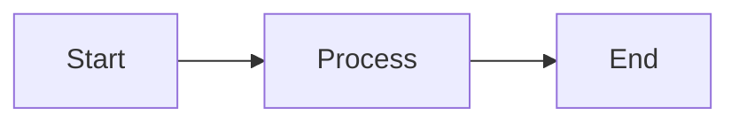

# 📚 Documentation Overview

This README describes how to work with Movie Genie's MkDocs-powered documentation system.

## 🚀 Quick Start

```bash
# Start documentation server
./scripts/docs.sh serve

# Or use MkDocs directly
mkdocs serve
```

Visit [http://127.0.0.1:8000](http://127.0.0.1:8000) to view the documentation.

## 🛠️ Documentation Commands

### Using the Documentation Script

```bash
# Start development server (default)
./scripts/docs.sh
./scripts/docs.sh serve

# Build documentation
./scripts/docs.sh build

# Deploy to GitHub Pages
./scripts/docs.sh deploy

# Validate setup
./scripts/docs.sh check

# Show help
./scripts/docs.sh help
```

### Using MkDocs Directly

```bash
# Install dependencies
pip install mkdocs-material mkdocs-git-revision-date-localized-plugin mkdocs-git-committers-plugin-2 mkdocs-minify-plugin

# Start development server
mkdocs serve

# Build documentation
mkdocs build

# Deploy to GitHub Pages
mkdocs gh-deploy
```

## 📁 Documentation Structure

```
docs/
├── index.md                     # Home page
├── getting-started/
│   ├── index.md                 # Getting started overview
│   ├── quick-start.md           # 5-minute setup
│   ├── installation.md          # Detailed installation
│   ├── project-overview.md      # Architecture overview
│   └── commands-reference.md    # Command reference
├── machine-learning/
│   ├── README.md               # ML overview
│   ├── models-overview.md      # Model comparison
│   ├── bert4rec.md            # BERT4Rec model
│   ├── two_tower.md           # Two-Tower model
│   ├── semantic-search.md     # Semantic search
│   └── evaluation.md          # Model evaluation
├── data-pipeline/
│   └── README.md              # Data pipeline overview
├── backend-frontend/
│   ├── README.md              # Architecture overview
│   ├── backend-integration.md # Backend setup
│   ├── ml-integration.md      # ML integration guide
│   └── api-reference.md       # API documentation
├── troubleshooting/
│   └── README.md              # Troubleshooting guide
├── reference/
│   ├── technology-stack.md    # Technology overview
│   └── project-structure.md   # File organization
├── stylesheets/
│   └── extra.css             # Custom styling
├── javascripts/
│   └── mathjax.js            # Math support
└── assets/                   # Images and media
```

## ⚙️ Configuration

The documentation is configured in `mkdocs.yml`:

- **Theme**: Material theme with dark/light mode
- **Plugins**: Search, git integration, minification
- **Extensions**: Mermaid diagrams, code highlighting, admonitions
- **Navigation**: Hierarchical structure with sections

## 🎨 Writing Documentation

### Markdown Features

The documentation supports enhanced Markdown with:

```markdown
# Standard Markdown
- Lists
- **Bold** and *italic* text
- `inline code`
- [Links](https://example.com)

# Enhanced Features
!!! note "Admonitions"
    Special callout boxes for notes, warnings, tips

!!! success "Success"
    Green success boxes

!!! warning "Warning"
    Yellow warning boxes

!!! danger "Danger"
    Red danger boxes

# Code blocks with syntax highlighting
```python
def hello_world():
    print("Hello, World!")
```

# Mermaid diagrams


# Math equations
\\( E = mc^2 \\)

# Grid cards
<div class="grid cards" markdown>
- Card 1
- Card 2
- Card 3
</div>
```

### Navigation Structure

Navigation is defined in `mkdocs.yml`. To add a new page:

1. Create the markdown file in the appropriate directory
2. Add it to the `nav` section in `mkdocs.yml`

Example:
```yaml
nav:
  - Home: index.md
  - Getting Started:
    - getting-started/index.md
    - New Page: getting-started/new-page.md
```

## 🔧 Customization

### Styling

Custom CSS is in `docs/stylesheets/extra.css`:

```css
/* Custom variables */
:root {
  --md-primary-fg-color: #4f46e5;
  --md-accent-fg-color: #f59e0b;
}

/* Custom classes */
.model-card {
  background: var(--md-default-bg-color);
  border-radius: 1rem;
  padding: 1.5rem;
}
```

### JavaScript

Custom JavaScript is in `docs/javascripts/`:

- `mathjax.js`: Math equation support

### Theme Configuration

The Material theme is configured in `mkdocs.yml`:

```yaml
theme:
  name: material
  features:
    - navigation.tabs        # Top-level tabs
    - navigation.sections    # Expand sections
    - navigation.top         # Back to top button
    - search.highlight       # Highlight search results
    - content.code.copy      # Copy code button
  palette:
    - scheme: default        # Light mode
      primary: indigo
    - scheme: slate          # Dark mode
      primary: indigo
```

## 🚀 Deployment

### GitHub Pages

The documentation can be automatically deployed to GitHub Pages:

```bash
# Deploy to gh-pages branch
./scripts/docs.sh deploy

# Or use MkDocs directly
mkdocs gh-deploy
```

### Manual Deployment

For other hosting platforms:

```bash
# Build documentation
mkdocs build

# Upload the site/ directory to your hosting provider
```

## 📊 Analytics and Monitoring

### Google Analytics

Add Google Analytics in `mkdocs.yml`:

```yaml
extra:
  analytics:
    provider: google
    property: G-XXXXXXXXXX
```

### Search

The search functionality is provided by the search plugin:

```yaml
plugins:
  - search:
      separator: '[\s\-,:!=\[\]()"`/]+|\.(?!\d)|&[lg]t;|(?!\b)(?=[A-Z][a-z])'
```

## 🔍 Troubleshooting

### Common Issues

1. **MkDocs not found**
   ```bash
   pip install mkdocs-material
   ```

2. **Build errors**
   ```bash
   # Check configuration
   mkdocs build --verbose
   ```

3. **Missing files**
   ```bash
   # Validate structure
   ./scripts/docs.sh check
   ```

4. **Plugin errors**
   ```bash
   # Install all plugins
   pip install mkdocs-material mkdocs-git-revision-date-localized-plugin mkdocs-git-committers-plugin-2 mkdocs-minify-plugin
   ```

### Development Tips

- Use `mkdocs serve` for live reload during development
- Check the console for build warnings and errors
- Test navigation and links before deploying
- Validate Markdown syntax with a linter

---

*This documentation system provides a professional, searchable, and maintainable reference for Movie Genie. The MkDocs setup ensures easy navigation and a great reading experience across all devices.* 📚