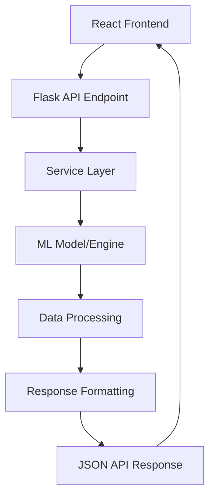

# Backend Integration Guide

This document provides a comprehensive overview of how the Movie Genie backend integrates with the frontend, APIs, and ML infrastructure to deliver AI-powered movie recommendations.

## Architecture Overview

```
┌─────────────────┐    ┌──────────────────┐    ┌─────────────────┐
│  React Frontend │────│   Flask Backend  │────│ML Infrastructure│
│                 │    │                  │    │                 │
│ - UI Components │    │ - API Routes     │    │ - BERT4Rec      │
│ - State Mgmt    │    │ - Services Layer │    │ - Two-Tower     │
│ - HTTP Client   │    │ - Model Loading  │    │ - Semantic Search│
└─────────────────┘    └──────────────────┘    └─────────────────┘
```

## Frontend-Backend Integration

### 1. User Authentication and Session Management

The application includes a user selection modal that integrates with the backend user management system:

#### User Selection Modal (`UserSelectionModal.tsx`)
```typescript
// API call to get valid user range
const { data: userInfo, isLoading, error } = useQuery({
  queryKey: ['userInfo'],
  queryFn: () => MovieGenieAPI.getUserInfo()
});

// Validation logic
const isValidUserId = (id: string): boolean => {
  if (!userInfo || !userInfo.user_id_range || !id.trim()) return false;
  const numId = parseInt(id);
  if (isNaN(numId)) return false;
  return numId >= userInfo.user_id_range.min && numId <= userInfo.user_id_range.max;
};
```

#### Backend User Info API (`/api/users/info`)
```python
@api_bp.route('/users/info', methods=['GET'])
def get_user_info():
    """Get information about available users and valid ID ranges."""
    try:
        user_data = load_user_data()
        user_ids = user_data['user_id'].unique()

        return jsonify({
            "success": True,
            "message": f"User database contains {len(user_ids)} users",
            "data": {
                "user_id_range": {
                    "min": int(user_ids.min()),
                    "max": int(user_ids.max()),
                    "total": len(user_ids)
                },
                "interaction_stats": {
                    "mean_interactions_per_user": float(interactions_per_user.mean()),
                    "min_interactions": int(interactions_per_user.min()),
                    "max_interactions": int(interactions_per_user.max()),
                    "median_interactions": float(interactions_per_user.median())
                },
                "sample_user_ids": user_ids[:10].tolist(),
                "instructions": {
                    "valid_range": f"Choose a user ID between {user_ids.min()} and {user_ids.max()}",
                    "note": "Each user has different viewing preferences that affect personalized recommendations"
                }
            }
        })
    except Exception as e:
        logger.error(f"Error getting user info: {e}")
        return jsonify({"success": False, "message": "Failed to load user information"}), 500
```

### 2. Search Interface Integration

The frontend includes a sophisticated search interface with grid-based results display:

#### Search Grid Component (`SearchResultsGrid.tsx`)
```typescript
// Search results displayed in responsive grid
<div className="grid grid-cols-2 md:grid-cols-3 lg:grid-cols-4 xl:grid-cols-5 gap-4 max-h-[600px] overflow-y-auto">
  {searchResults.map((movie) => (
    <Card key={movie.id} className="movie-card-styling" onClick={() => onMovieClick(movie.id)}>
      <div className="aspect-[2/3] bg-muted flex items-center justify-center relative">
         {
               // Fallback to gradient display
               e.currentTarget.style.display = 'none';
               e.currentTarget.nextElementSibling.style.display = 'flex';
             }}
        />
        <div className="w-full h-full bg-gradient-to-br from-primary/20 to-accent/20 flex items-center justify-center text-muted-foreground text-sm hidden">
          {movie.title}
        </div>
      </div>
    </Card>
  ))}
</div>
```

#### Search Behavior
- **Trigger**: Search executes only on Enter key press (not on every keystroke)
- **Mode Switch**: Search results replace carousel view completely
- **Navigation**: Back button returns to main carousel view and clears search
- **Visual Consistency**: Search grid cards use same styling as homepage movie thumbnails

### 3. Build Process Integration

The frontend and backend are integrated through a sophisticated build process managed by DVC:

#### Frontend Build Configuration (`movie_genie/frontend/vite.config.ts`)
```typescript
build: {
  outDir: "../backend/dist",      // Build to backend dist
  emptyOutDir: true,
  rollupOptions: {
    output: {
      // Place JS and CSS files in Flask's static directory structure
      assetFileNames: (assetInfo) => {
        const extType = assetInfo.name?.split('.').pop();
        if (extType === 'css') {
          return 'css/[name]-[hash][extname]';
        }
        if (['png', 'jpg', 'jpeg', 'svg', 'gif', 'webp'].includes(extType || '')) {
          return 'img/[name]-[hash][extname]';
        }
        return 'assets/[name]-[hash][extname]';
      },
      chunkFileNames: 'js/[name]-[hash].js',
      entryFileNames: 'js/[name]-[hash].js',
    },
  },
},
// Configure base path for Flask static files
base: mode === 'production' ? '/static/' : '/',
```

#### DVC Pipeline Integration (`dvc.yaml`)
```yaml
frontend_build:
  cmd: >
    cd movie_genie/frontend && npm run build &&
    cp ../backend/dist/index.html ../backend/templates/ &&
    mkdir -p ../backend/static &&
    cp -r ../backend/dist/css ../backend/static/ &&
    cp -r ../backend/dist/js ../backend/static/ &&
    [ -d ../backend/dist/img ] && cp -r ../backend/dist/img ../backend/static/ || true &&
    [ -d ../backend/dist/assets ] && cp -r ../backend/dist/assets ../backend/static/ || true
  deps:
    - movie_genie/frontend/src/
    - movie_genie/frontend/package.json
    - movie_genie/frontend/vite.config.ts
    - movie_genie/frontend/.env.development
  outs:
    - movie_genie/backend/templates/index.html
    - movie_genie/backend/static/
```

**Process Flow:**
1. Vite builds React app to `backend/dist/`
2. DVC copies `index.html` to `backend/templates/`
3. DVC copies `static/` directory to `backend/static/`
4. Flask serves frontend from these locations

### 2. Static File Serving

The Flask backend serves the React frontend through configured static and template directories:

#### Flask Configuration (`movie_genie/backend/app.py`)
```python
app = Flask(__name__,
           static_folder='static',
           template_folder='templates')

@app.route('/')
def serve_frontend():
    """Serve the React frontend."""
    try:
        return render_template('index.html')
    except Exception as e:
        logger.error(f"Error serving frontend: {e}")
        return "Frontend not available", 404
```

#### Frontend Status Monitoring
```python
def check_frontend_build_status():
    """Check if frontend files are properly built."""
    template_path = Path(app.template_folder) / 'index.html'
    static_path = Path(app.static_folder)

    return {
        'templates': '✅' if template_path.exists() else '❌',
        'static_files': '✅' if static_path.exists() else '❌'
    }
```

## API Architecture

### 1. RESTful API Design

The backend exposes a comprehensive RESTful API with the following structure:

```
/api/
├── health              # Health check endpoint
├── users/
│   └── info           # User information and valid ID ranges
├── movies/
│   ├── popular         # Popular movies
│   └── <id>           # Movie details by ID
├── search/
│   └── semantic       # Semantic search
├── recommendations/
│   └── personalized   # Personalized recommendations
└── feedback           # User feedback collection
```

### 2. API Blueprints Structure

#### Main Application Factory (`movie_genie/backend/app/__init__.py`)
```python
def create_app(config_class=DevelopmentConfig):
    app = Flask(__name__)
    app.config.from_object(config_class)

    # Register API blueprints
    from .api import api_bp
    app.register_blueprint(api_bp, url_prefix='/api')

    return app
```

#### API Blueprint Registration (`movie_genie/backend/app/api/__init__.py`)
```python
from flask import Blueprint

api_bp = Blueprint('api', __name__)

# Import and register sub-modules
from . import health, movies, search, recommendations, feedback
```

### 3. API Endpoints Detail

#### Health Check (`/api/health`)
```python
@api_bp.route('/health', methods=['GET'])
def health_check():
    return jsonify({
        "status": "healthy",
        "message": "Movie Genie API is running",
        "version": "1.0.0"
    })
```

#### Semantic Search (`/api/search/semantic`)
```python
@api_bp.route('/search/semantic', methods=['GET'])
def semantic_search():
    query = request.args.get('q', '')
    k = int(request.args.get('k', 20))
    user_id = request.args.get('user_id')

    # Use search service
    results = search_service.semantic_search(
        query=query, k=k,
        user_context={'user_id': user_id} if user_id else None
    )

    return jsonify({
        "success": True,
        "message": f"Found {results['total']} movies for '{query}'",
        "data": results
    })
```

#### Personalized Recommendations (`/api/recommendations/personalized`)
```python
@api_bp.route('/recommendations/personalized', methods=['POST'])
def personalized_recommendations():
    data = request.get_json() or {}
    user_id = data.get('user_id')
    history = data.get('interaction_history', [])
    limit = data.get('limit', 5)

    # Use recommendation service
    results = recommendation_service.get_personalized_recommendations(
        user_id=user_id,
        interaction_history=history,
        limit=limit
    )

    return jsonify({
        "success": True,
        "data": results
    })
```

## ML Infrastructure Integration

### 1. Service Layer Architecture

The backend uses a service layer pattern to integrate with ML models:

```
Controllers (API Routes)
    ↓
Services Layer
    ↓
ML Models & Data Processing
```

#### Services Structure:
- `SearchService`: Handles semantic search operations
- `RecommendationService`: Manages personalized recommendations
- `MovieService`: Movie data operations

### 2. Semantic Search Integration

#### SearchService (`movie_genie/backend/app/services/search_service.py`)
```python
class SearchService:
    def __init__(self, config_path=None):
        self.semantic_engine = None
        self.config_path = config_path or str(project_root / "configs" / "semantic_search.yaml")
        self._initialize_search_engine()

    def _initialize_search_engine(self):
        """Initialize the semantic search engine with path resolution."""
        try:
            from movie_genie.search.semantic_engine import SemanticSearchEngine
            self.semantic_engine = SemanticSearchEngine(self.config_path)
            logger.info("✅ SemanticSearchEngine initialized successfully")
        except Exception as e:
            logger.error(f"❌ Failed to initialize SemanticSearchEngine: {e}")

    def semantic_search(self, query: str, k: int = 20, user_context=None):
        """Perform semantic search with optional personalization."""
        if not self.semantic_engine:
            return self._fallback_response(query)

        results = self.semantic_engine.search(query, k, user_context)
        return self._format_api_response(results, query)
```

#### Semantic Search Engine (`movie_genie/search/semantic_engine.py`)
```python
class SemanticSearchEngine:
    def __init__(self, config_path: str = "configs/semantic_search.yaml"):
        # Dynamic path resolution for deployment flexibility
        self.project_root = self._find_project_root()

        # Initialize components with resolved paths
        self.query_encoder = QueryEncoder(config_path)

        movies_path = self.config['movies_path']
        if not Path(movies_path).is_absolute():
            movies_path = str(self.project_root / movies_path)

        self.movie_loader = MovieEmbeddingLoader(movies_path)
        self.movie_embeddings, self.movie_metadata = self.movie_loader.get_embeddings_and_metadata()

    def _find_project_root(self) -> Path:
        """Find project root by looking for pyproject.toml or dvc.yaml."""
        current_path = Path(__file__).resolve()
        for parent in current_path.parents:
            if (parent / 'pyproject.toml').exists() or (parent / 'dvc.yaml').exists():
                return parent
        return Path.cwd()
```

### 3. Recommendation System Integration

#### RecommendationService (`movie_genie/backend/app/services/recommendation_service.py`)
```python
class RecommendationService:
    def __init__(self):
        self.bert4rec_reranker = None
        self.two_tower_reranker = None
        self._initialize_models()

    def _initialize_models(self):
        """Initialize recommendation models with proper error handling."""
        try:
            # BERT4Rec for sequential recommendations
            self.bert4rec_reranker = BERT4RecReranker(
                model_path="models/bert4rec/bert4rec_model.pth",
                data_artifacts_path="models/bert4rec/data_artifacts.pkl"
            )

            # Two-Tower for collaborative filtering
            self.two_tower_reranker = TwoTowerReranker(
                model_path="models/two_tower/two_tower_model.pth"
            )

        except Exception as e:
            logger.error(f"Model initialization failed: {e}")

    def get_personalized_recommendations(self, user_id=None, interaction_history=None, limit=5):
        """Generate personalized recommendations using available models."""
        # Get base recommendations (popular movies as fallback)
        base_movies = self.movie_service.get_popular_movies(limit * 3)

        # Apply personalization if user context available
        if interaction_history and self.bert4rec_reranker:
            user_context = {
                'user_id': user_id,
                'interaction_history': interaction_history
            }
            personalized = self.bert4rec_reranker.rerank(base_movies, user_context)
            return personalized[:limit]

        return base_movies[:limit]
```

### 4. Model Loading and Management

#### BERT4Rec Model Loading
```python
class BERT4RecReranker(SearchReranker):
    def _load_model(self):
        """Load BERT4Rec model with proper reconstruction."""
        # Load data artifacts for model configuration
        with open(self.data_artifacts_path, 'rb') as f:
            self.data_artifacts = pickle.load(f)

        # Load model state dict
        state_dict = torch.load(self.model_path, map_location='cpu')

        # Reconstruct model with correct parameters
        from movie_genie.ranking.bert4rec_model import BERT4RecModel

        self.model = BERT4RecModel(
            num_items=self.data_artifacts['num_movies'],
            content_feature_dim=768,  # EmbeddingGemma dimension
            max_seq_len=50,
            hidden_dim=256,
            num_layers=4,
            num_heads=8,
            dropout_rate=0.1
        )

        self.model.load_state_dict(state_dict)
        self.model.eval()
```

#### Two-Tower Model Loading with Config
```python
class TwoTowerReranker(SearchReranker):
    def _load_model(self):
        """Load Two-Tower model with configuration-based reconstruction."""
        # Load model configuration
        config_path = self.model_path.parent / 'model_config.json'
        with open(config_path, 'r') as f:
            config = json.load(f)

        # Load state dict
        state_dict = torch.load(self.model_path, map_location='cpu')

        # Reconstruct model if needed
        if not hasattr(state_dict, 'eval'):
            from movie_genie.retrieval.two_tower_model import TwoTowerModel

            model_config = config.get('training_config', {}).get('model', config)
            self.model = TwoTowerModel(
                num_users=config['num_users'],
                num_movies=config['num_movies'],
                content_feature_dim=config['content_feature_dim'],
                embedding_dim=model_config.get('embedding_dim', 128),
                user_hidden_dims=model_config.get('user_hidden_dims', [128, 64]),
                item_hidden_dims=model_config.get('item_hidden_dims', [256, 128]),
                dropout_rate=model_config.get('dropout_rate', 0.1)
            )

            self.model.load_state_dict(state_dict)
        else:
            self.model = state_dict

        self.model.eval()
```

## Data Flow Architecture

### 1. Request Processing Flow



### 2. ML Pipeline Integration

#### Data Sources and Processing:
```
Raw Data (MovieLens + TMDB)
    ↓ (DVC Pipeline: ingest)
Processed User Sequences
    ↓ (DVC Pipeline: training)
Trained Models (BERT4Rec, Two-Tower)
    ↓ (DVC Pipeline: backend_server)
Loaded Models in Flask App
    ↓ (Runtime)
API Responses with Predictions
```

### 3. Configuration Management

#### Centralized Configuration (`configs/`)
```yaml
# semantic_search.yaml
model_name: "google/embeddinggemma-300M"
movies_path: "data/processed/content_features.parquet"
reranker:
  enabled: true
  type: "bert4rec"
  model_path: "models/bert4rec/bert4rec_model.pth"
  data_artifacts_path: "models/bert4rec/data_artifacts.pkl"
```

#### Environment-Based Config (`movie_genie/backend/config.py`)
```python
class DevelopmentConfig(Config):
    FLASK_ENV = 'development'
    DEBUG = True

class ProductionConfig(Config):
    FLASK_ENV = 'production'
    DEBUG = False
```

## Error Handling and Monitoring

### 1. Graceful Degradation
```python
def semantic_search(self, query: str, k: int = 20, user_context=None):
    """Semantic search with fallback handling."""
    if not self.semantic_engine:
        logger.error("SemanticSearchEngine not available")
        return {
            'movies': [],
            'total': 0,
            'query': query,
            'search_type': 'semantic',
            'error': 'Search engine not available'
        }

    try:
        results = self.semantic_engine.search(query, k, user_context)
        return self._format_success_response(results, query)
    except Exception as e:
        logger.error(f"Semantic search failed: {e}")
        return self._format_error_response(query, str(e))
```

### 2. Health Monitoring
```python
def get_system_status():
    """Get comprehensive system status."""
    return {
        'frontend_status': check_frontend_build_status(),
        'api_status': 'healthy',
        'ml_models': {
            'semantic_search': search_service.is_available(),
            'bert4rec': recommendation_service.bert4rec_available(),
            'two_tower': recommendation_service.two_tower_available()
        },
        'data_sources': check_data_availability()
    }
```

## Deployment and DevOps

### 1. DVC Integration for ML Ops
```yaml
# Complete pipeline from data to deployment
backend_server:
  cmd: cd movie_genie/backend && python app.py
  deps:
    - movie_genie/backend/app.py
    - movie_genie/backend/templates/index.html  # Frontend dependency
    - movie_genie/backend/static/               # Frontend assets
    - models/two_tower/                         # ML models
    - models/bert4rec/
    - data/processed/content_features.parquet   # Data dependency
  always_changed: true
```

### 2. Production Deployment
```bash
# Production server setup
pip install gunicorn
export FLASK_ENV=production
export SECRET_KEY=your-production-secret

# Run with WSGI server
gunicorn -w 4 -b 0.0.0.0:5000 movie_genie.backend.app:app
```

### 3. Container Deployment (Docker)
```dockerfile
# Multi-stage build for frontend and backend
FROM node:18 AS frontend-build
WORKDIR /app/frontend

COPY movie_genie/frontend/ .
RUN npm install && npm run build

FROM python:3.9 AS backend
WORKDIR /app
COPY requirements.txt .
RUN pip install -r requirements.txt

COPY . .
COPY --from=frontend-build /app/frontend/../backend/dist/ /app/movie_genie/backend/

EXPOSE 5000
CMD ["gunicorn", "-w", "4", "-b", "0.0.0.0:5000", "movie_genie.backend.app:app"]
```

## Performance Considerations

### 1. Model Loading Optimization
- Models loaded once at startup, not per request
- Lazy loading for non-critical components
- Caching of embeddings and frequently accessed data

### 2. API Response Optimization
- Response compression for large result sets
- Pagination for large movie catalogs
- Caching of popular/frequent queries

### 3. Frontend Asset Optimization
- Static asset versioning with hash-based filenames
- Gzip compression for CSS/JS files
- CDN-ready static file structure

## Security Considerations

### 1. API Security
- Input validation and sanitization
- Rate limiting for API endpoints
- CORS configuration for frontend access

### 2. Model Security
- Model files stored securely
- Access controls for sensitive data
- Input validation for ML model inputs

## Current Working Implementation Status

### ✅ Fully Functional Features (Production Ready)

#### 1. **User Authentication System**
- **Status**: ✅ Working
- **Components**: User selection modal with validation
- **API**: `/api/users/info` returns valid user ID ranges (1-610)
- **Validation**: Real-time client-side validation with server data
- **UX**: Modal blocks access until valid user ID entered

#### 2. **Search Interface**
- **Status**: ✅ Working
- **Trigger**: Enter key press (not keystroke-based)
- **Display**: 5×4 responsive grid layout with scrolling
- **Visual**: Gradient fallback cards matching homepage styling
- **Navigation**: Back button returns to main view and clears search
- **Mode**: Complete replacement of carousel view during search

#### 3. **Frontend-Backend Integration**
- **Status**: ✅ Working
- **Build Process**: Automated via DVC pipeline
- **API Communication**: Proper error handling and data extraction
- **Asset Serving**: Static files served correctly via Flask
- **Port Configuration**: Backend on 5001, frontend properly configured

#### 4. **API Response Structure**
- **Status**: ✅ Working
- **Format**: Standardized `{data: {...}, success: boolean, message: string}` wrapper
- **Client Handling**: Frontend properly extracts data from wrapper
- **Error Handling**: Graceful degradation with user feedback

### 🚧 Using Mock Data (Development Ready)

#### 1. **Search Results**
- **Current**: 20 placeholder movies generated based on search query
- **Display**: Full grid layout with proper styling
- **Integration Point**: Ready for real semantic search API integration

#### 2. **Homepage Carousels**
- **Current**: Mock movie data for all recommendation sections
- **Categories**: Popular, Historical Interest, Recommendations, User History
- **Integration Point**: Ready for real ML recommendation API integration

#### 3. **Movie Details**
- **Current**: Basic placeholder information
- **Integration Point**: Ready for detailed movie metadata API

### 🔧 Configuration Details

#### Environment Configuration (`movie_genie/frontend/.env.development`)
```bash
VITE_API_URL=http://127.0.0.1:5001/api
VITE_APP_TITLE=Movie Genie - Development
VITE_ENABLE_MOCK_API=false
VITE_LOG_LEVEL=debug
VITE_ENABLE_DEVTOOLS=true
```

#### Server Deployment
- **Backend**: Flask server on port 5001
- **Frontend**: Built and served by Flask as static assets
- **DVC Pipeline**: Automated build and deployment process
- **Development**: Hot reload during development, production build for deployment

### 🚀 Getting Started (Current Working Setup)

#### 1. Start the Full Stack
```bash
# Start DVC pipeline (includes backend server)
dvc repro

# Or start manually:
cd movie_genie/backend && python app.py
```

#### 2. Access the Application
```bash
# Frontend served by Flask backend
http://127.0.0.1:5001

# API endpoints available at:
http://127.0.0.1:5001/api/health
http://127.0.0.1:5001/api/users/info
```

#### 3. User Flow
1. **User Selection**: Enter user ID (1-610) in modal
2. **Main Interface**: Browse recommendations in carousel format
3. **Search**: Type query and press Enter for grid results
4. **Movie Details**: Click any movie for details in sidebar
5. **Navigation**: Use back button to return from search

### 📊 Integration Readiness

The current implementation provides a solid foundation for ML integration:

- **User Context**: User ID properly passed through all API calls
- **Search Interface**: Ready for semantic search engine integration
- **Recommendation Display**: Components ready for personalized recommendations
- **Error Handling**: Graceful fallbacks when ML services unavailable
- **Performance**: Optimized build process and asset delivery

This comprehensive integration ensures that Movie Genie operates as a cohesive, production-ready application with seamless frontend-backend-ML integration.

## Endpoint Connection Setup

### Overview

The Movie Genie application connects the React frontend with the Flask backend through a well-defined API contract. This section documents the endpoint configuration and connection setup.

### API Endpoint Mapping

All backend API responses follow a standardized wrapper format:

```json
{
  "success": true,
  "data": { /* actual response data */ },
  "message": "Success message",
  "error_code": "optional error code",
  "details": "optional additional details"
}
```

The frontend API client automatically unwraps the `data` field for seamless integration.

#### Connected Endpoints

| Feature | Frontend Method | Backend Endpoint | HTTP Method | Status |
|---------|----------------|------------------|-------------|--------|
| Popular Movies | `MovieDataService.getPopularMovies()` | `/api/movies/popular` | GET | ✅ |
| Semantic Search | `MovieDataService.searchMovies()` | `/api/search/semantic` | GET | ✅ |
| Movie Details | `MovieDataService.getMovieDetails()` | `/api/movies/{id}` | GET | ✅ |
| Personalized Recommendations | `MovieDataService.getPersonalizedRecommendations()` | `/api/recommendations/personalized` | POST | ✅ |
| Submit Feedback | `MovieGenieAPI.submitFeedback()` | `/api/feedback` | POST | ✅ |
| Submit Rating | `MovieGenieAPI.submitRating()` | `/api/feedback/rating` | POST | ✅ |
| User Information | `MovieGenieAPI.getUserInfo()` | `/api/users/info` | GET | ✅ |
| User Profile | `MovieGenieAPI.getUserProfile()` | `/api/users/{id}/profile` | GET | ✅ |

### Frontend API Configuration

#### API Client (`movie_genie/frontend/src/lib/api.ts`)

The frontend API client handles all communication with the backend:

```typescript
// API Configuration
const API_BASE_URL = import.meta.env.VITE_API_URL || 'http://localhost:5000/api';

export const API_ENDPOINTS = {
  // Search endpoints
  SEARCH: `${API_BASE_URL}/search`,
  SEMANTIC_SEARCH: `${API_BASE_URL}/search/semantic`,

  // Movie endpoints
  MOVIE_DETAILS: (id: string) => `${API_BASE_URL}/movies/${id}`,
  POPULAR_MOVIES: `${API_BASE_URL}/movies/popular`,

  // Recommendation endpoints
  RECOMMENDATIONS: `${API_BASE_URL}/recommendations`,
  PERSONALIZED_RECOMMENDATIONS: `${API_BASE_URL}/recommendations/personalized`,

  // User feedback endpoints
  FEEDBACK: `${API_BASE_URL}/feedback`,
  RATING: `${API_BASE_URL}/feedback/rating`,

  // User endpoints
  USER_INFO: `${API_BASE_URL}/users/info`,
  USER_PROFILE: (userId: number) => `${API_BASE_URL}/users/${userId}/profile`,
} as const;
```

#### Response Unwrapping

The API client automatically unwraps backend responses:

```typescript
interface APIResponse<T> {
  success: boolean;
  data: T;
  message: string;
  error_code?: string;
  details?: any;
}

class MovieGenieAPI {
  private static async fetchAPI<T>(url: string, options?: RequestInit): Promise<T> {
    const response = await fetch(url, {
      headers: {
        'Content-Type': 'application/json',
        ...options?.headers,
      },
      ...options,
    });

    if (!response.ok) {
      const errorData = await response.json().catch(() => ({}));
      throw new Error(errorData.message || `API Error: ${response.status}`);
    }

    const jsonResponse: APIResponse<T> = await response.json();

    // Unwrap the backend response format
    if (jsonResponse.success && jsonResponse.data !== undefined) {
      return jsonResponse.data;
    }

    return jsonResponse as unknown as T;
  }
}
```

### Data Source Configuration

The frontend uses environment variables to toggle between real API data and mock data for development:

#### Environment Configuration (`movie_genie/frontend/.env.development`)

```bash
# API Configuration
VITE_API_URL=http://127.0.0.1:5001/api
VITE_APP_TITLE=Movie Genie - Development
VITE_ENABLE_MOCK_API=false

# Data Source Configuration (true = use real API, false = use mock data)
VITE_USE_REAL_POPULAR=true
VITE_USE_REAL_SEARCH=true
VITE_USE_REAL_RECOMMENDATIONS=true
VITE_USE_REAL_MOVIE_DETAILS=true

# Development-specific settings
VITE_LOG_LEVEL=debug
VITE_ENABLE_DEVTOOLS=true
```

#### Movie Data Service with Fallback

The `MovieDataService` provides automatic fallback to mock data if the API is unavailable:

```typescript
export class MovieDataService {
  // Get popular movies (with fallback)
  static async getPopularMovies(limit: number = 20): Promise<MovieData[]> {
    if (DATA_SOURCE_CONFIG.popular) {
      try {
        console.log('🔄 Attempting to fetch real popular movies...');
        const response = await MovieGenieAPI.getPopularMovies(limit);
        const movies = response.movies?.map(this.transformApiMovie) || [];
        console.log('✅ Got real popular movies:', movies.length);
        return movies;
      } catch (error) {
        console.warn('⚠️ Real popular movies failed, falling back to mock data:', error);
      }
    }

    console.log('📝 Using mock popular movies');
    return Array.from({length: limit}, (_, i) =>
      this.createMockMovie(i + 1, `Popular Movie ${i + 1}`, 'Popular')
    );
  }

  // Transform API response to frontend format
  private static transformApiMovie(apiMovie: any): MovieData {
    return {
      id: apiMovie.movieId?.toString() || apiMovie.id?.toString(),
      title: apiMovie.title,
      poster_url: apiMovie.poster_path
        ? `https://image.tmdb.org/t/p/w500${apiMovie.poster_path}`
        : null,
      genres: apiMovie.genres || [],
      rating: apiMovie.vote_average,
      overview: apiMovie.overview,
      release_date: apiMovie.release_date,
      runtime: apiMovie.runtime,
    };
  }
}
```

### Backend Server Configuration

#### Flask Backend Environment (`movie_genie/backend/.env`)

```bash
# Flask settings
FLASK_ENV=development
FLASK_HOST=127.0.0.1
FLASK_PORT=5001

# Secret key for sessions
SECRET_KEY=dev-secret-key-change-in-production

# Database URL
DATABASE_URL=sqlite:///movie_genie.db

# Logging
LOG_LEVEL=INFO

# CORS origins (for frontend development)
CORS_ORIGINS=http://localhost:8080,http://localhost:3000,http://localhost:5000
```

#### CORS Configuration

The backend is configured to allow cross-origin requests from the frontend:

```python
# Development config allows all origins
class DevelopmentConfig(Config):
    DEBUG = True
    CORS_ORIGINS = ["*"]

# Production config specifies allowed origins
class ProductionConfig(Config):
    DEBUG = False
    CORS_ORIGINS = ["http://localhost:8080", "http://localhost:3000"]
```

### Starting the Application

#### Step 1: Start Backend Server

```bash
cd movie_genie/backend
python app.py
```

Expected output:
```
🎬 Movie Genie Backend Starting...

🌐 Server: http://127.0.0.1:5001
🔧 Environment: development
🎯 API Base URL: http://127.0.0.1:5001/api
📱 Frontend: http://127.0.0.1:5001

📋 Available endpoints:
   • GET  /api/health              - Health check
   • GET  /api/search/semantic     - Semantic movie search
   • GET  /api/movies/<id>         - Movie details
   • GET  /api/movies/popular      - Popular movies
   • POST /api/recommendations/personalized - Personalized recommendations
   • POST /api/feedback            - Submit user feedback

🚀 Starting Flask server...
```

#### Step 2: Start Frontend Development Server

In a new terminal:

```bash
cd movie_genie/frontend
npm run dev
```

The frontend will be available at `http://localhost:8080`

### Testing the Connection

#### Browser Console Verification

When the application loads, you should see these logs in the browser console:

```
🔄 Attempting to fetch real popular movies...
✅ Got real popular movies: 20
🔄 Attempting real semantic search for: action movies
✅ Got real search results: 15
```

#### API Health Check

Test the backend API directly:

```bash
# Health check
curl http://127.0.0.1:5001/api/health

# Popular movies
curl http://127.0.0.1:5001/api/movies/popular?limit=5

# Semantic search
curl "http://127.0.0.1:5001/api/search/semantic?q=action+movies"

# Movie details
curl http://127.0.0.1:5001/api/movies/1
```

### Troubleshooting

#### Backend Not Starting

**Check Python dependencies:**
```bash
pip install flask flask-cors flask-sqlalchemy python-dotenv
```

**Verify port availability:**
```bash
lsof -i :5001
```

#### Frontend Shows Mock Data

**Verify environment variables are loaded:**
```bash
cd movie_genie/frontend
cat .env.development
```

**Restart frontend after changing environment variables:**
```bash
# Stop the dev server (Ctrl+C)
npm run dev
```

#### CORS Errors

**Check backend CORS configuration:**
- Development mode should have `CORS_ORIGINS = ["*"]`
- Verify frontend URL is in allowed origins list

**Check browser network tab:**
- Look for preflight OPTIONS requests
- Verify `Access-Control-Allow-Origin` header is present

#### API Returns 404

**Verify backend is running:**
```bash
lsof -i :5001  # Should show Python process
```

**Check API base URL:**
```bash
echo $VITE_API_URL  # Should be http://127.0.0.1:5001/api
```

**Verify endpoint paths match backend routes**

### Development Workflow

#### Hot Reloading

- **Frontend**: Vite provides instant hot module replacement
- **Backend**: Flask debug mode auto-reloads on code changes

#### Switching Between Real/Mock Data

Edit `movie_genie/frontend/.env.development`:

```bash
# Use real API
VITE_USE_REAL_SEARCH=true

# Use mock data (for offline development)
VITE_USE_REAL_SEARCH=false
```

Restart the frontend dev server to apply changes.

#### Adding New Endpoints

1. **Backend**: Add endpoint in `movie_genie/backend/app/api/*.py`
2. **Frontend API**: Add method in `movie_genie/frontend/src/lib/api.ts`
3. **Service Layer**: Use in `MovieDataService` with fallback support
4. **Documentation**: Update this guide and API reference

This connection setup ensures seamless integration between the frontend and backend while providing flexibility for development and graceful degradation in production.