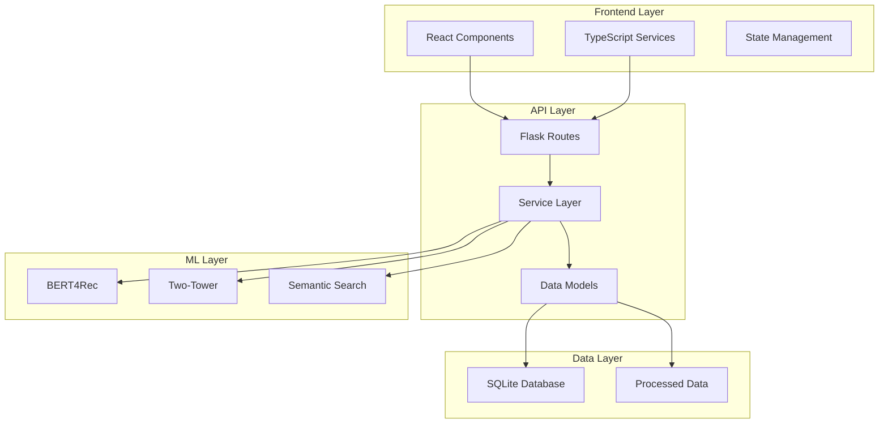
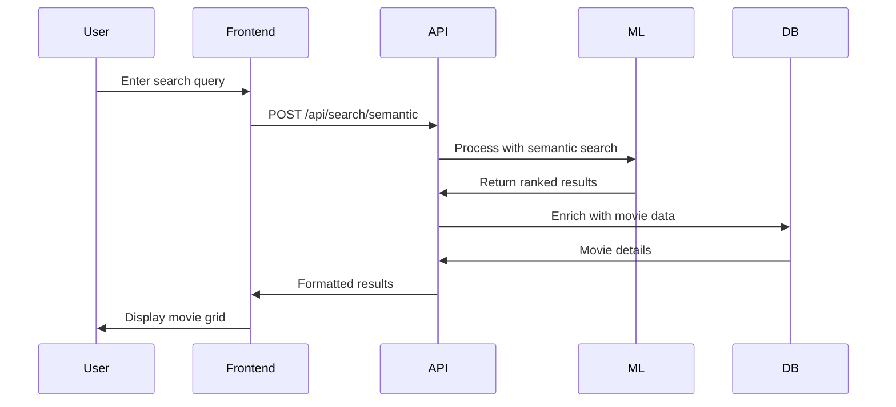
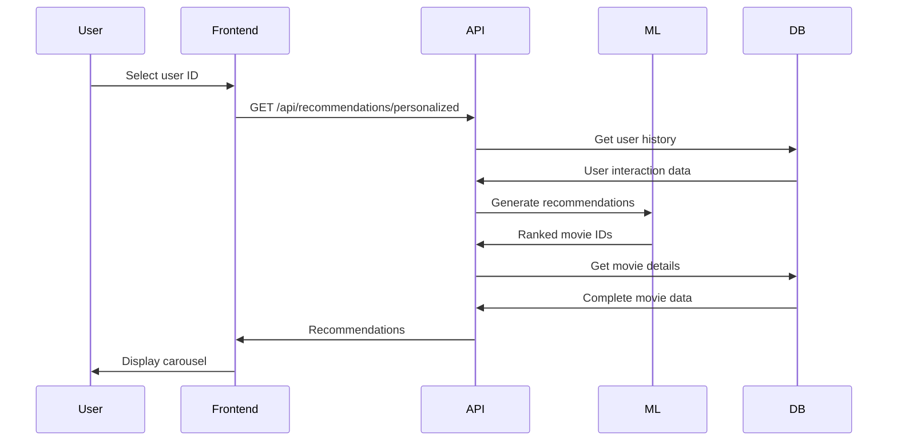

# Backend & Frontend Architecture

Complete guide to Movie Genie's full-stack architecture and integration patterns.

## Architecture Overview

Movie Genie follows a modern full-stack architecture with clear separation of concerns:



## Key Components

<div class="grid cards" markdown>

-   :material-react:{ .lg .middle } **Frontend (React)**

    ---

    Modern React application with TypeScript, Tailwind CSS, and component-based architecture.

    **Features**:
    - User selection modal
    - Search interface with grid results
    - Movie thumbnails and details
    - Real/mock data switching

-   :material-flask:{ .lg .middle } **Backend (Flask)**

    ---

    Lightweight Flask API with service layer pattern and ML model integration.

    **Features**:
    - RESTful API endpoints
    - ML model serving
    - Database operations
    - Error handling and validation

-   :material-brain:{ .lg .middle } **ML Integration**

    ---

    Seamless integration between ML models and web application.

    **Features**:
    - Real-time model inference
    - Fallback mechanisms
    - Performance optimization
    - Result transformation

-   :material-database:{ .lg .middle } **Data Management**

    ---

    Efficient data storage and retrieval with SQLite database.

    **Features**:
    - Movie and user data
    - Rating interactions
    - Optimized queries
    - Data validation

</div>

## Development Workflow

### Backend Development
```bash
# Start Flask development server
cd movie_genie/backend
python app.py

# Server runs on http://127.0.0.1:5001
# API available at http://127.0.0.1:5001/api
```

### Frontend Development
```bash
# Start React development server
cd movie_genie/frontend
npm install
npm run dev

# Server runs on http://localhost:5173
# Hot reload enabled for development
```

### Full-Stack Development
```bash
# Terminal 1: Backend
cd movie_genie/backend && python app.py

# Terminal 2: Frontend
cd movie_genie/frontend && npm run dev

# Or use DVC pipeline for integrated setup
dvc repro backend_server
```

## API Endpoints

### Core Endpoints
| Endpoint | Method | Description |
|----------|--------|-------------|
| `/api/health` | GET | System health check |
| `/api/users/info` | GET | User information |
| `/api/movies/popular` | GET | Popular movies (optionally personalized) |
| `/api/movies/{id}` | GET | Movie details with similar movies |
| `/api/search/semantic` | GET | ML-powered semantic search |
| `/api/recommendations/personalized` | GET | User-specific recommendations |

### Example API Call
```bash
# Test semantic search
curl "http://127.0.0.1:5001/api/search/semantic?q=action%20movies&limit=10"

# Get personalized recommendations
curl "http://127.0.0.1:5001/api/recommendations/personalized?user_id=123&limit=10"
```

## Data Flow Patterns

### Search Flow


### Recommendation Flow


## Configuration Management

### Environment Variables
```bash
# Backend (.env)
FLASK_ENV=development
FLASK_DEBUG=1
FLASK_PORT=5001
DATABASE_URL=sqlite:///movie_genie.db

# Frontend (.env.development)
VITE_API_URL=http://127.0.0.1:5001/api
VITE_USE_REAL_POPULAR=true
VITE_USE_REAL_SEARCH=true
VITE_USE_REAL_RECOMMENDATIONS=true
```

### Data Source Switching
The frontend supports switching between real API data and mock data:

```typescript
// Controlled by environment variables
const DATA_SOURCE_CONFIG = {
  popular: import.meta.env.VITE_USE_REAL_POPULAR === 'true',
  search: import.meta.env.VITE_USE_REAL_SEARCH === 'true',
  recommendations: import.meta.env.VITE_USE_REAL_RECOMMENDATIONS === 'true'
};
```

## Performance Optimization

### Backend Optimization
- **Database Indexing**: Optimized queries for movie and user lookups
- **Model Caching**: In-memory storage of trained models
- **Response Compression**: Efficient JSON serialization
- **Error Handling**: Graceful degradation and fallbacks

### Frontend Optimization
- **Code Splitting**: Lazy loading of components
- **Image Optimization**: Responsive images with fallbacks
- **State Management**: Efficient React state updates
- **Bundle Optimization**: Vite build optimization

## Testing Strategy

### Backend Testing
```bash
# Unit tests for services
pytest movie_genie/backend/tests/test_services.py

# API integration tests
pytest movie_genie/backend/tests/test_api.py

# ML model integration tests
python tests/test_ml_integration.py
```

### Frontend Testing
```bash
# Component tests
cd movie_genie/frontend
npm test

# End-to-end tests (if available)
npm run test:e2e
```

## Detailed Guides

For comprehensive implementation details, see:

- **[Backend Integration](backend-integration.md)**: Flask setup, service layer, database integration, and endpoint connection
- **[ML Integration](ml-integration.md)**: Step-by-step ML model to frontend connection
- **[API Reference](api-reference.md)**: Complete endpoint documentation with examples

### What's in Each Guide

- **Backend Integration**: Covers the complete Flask application setup including:
    - Frontend-backend integration and build process
    - API architecture and blueprints
    - ML infrastructure integration
    - **Endpoint connection setup** with API mapping and configuration
    - Starting the application and troubleshooting

- **ML Integration**: Step-by-step guide for connecting ML models to the web interface

- **API Reference**: Detailed API endpoint documentation with request/response examples

## Troubleshooting

### Common Issues

!!! warning "API Connection Failed"
    ```bash
    # Check backend is running
    curl http://127.0.0.1:5001/api/health

    # Verify frontend environment
    cat movie_genie/frontend/.env.development
    ```

!!! danger "CORS Errors"
    ```python
    # Ensure CORS is enabled in Flask app
    from flask_cors import CORS
    app = Flask(__name__)
    CORS(app)
    ```

!!! info "Slow Performance"
    ```bash
    # Check model loading
    python -c "from movie_genie.ranking.bert4rec_model import BERT4RecReranker; print('Models loaded')"

    # Monitor API response times
    curl -w "@curl-format.txt" http://127.0.0.1:5001/api/movies/popular
    ```

This architecture provides a solid foundation for modern full-stack ML applications with clear separation of concerns and scalable design patterns.