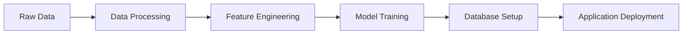

# Data Pipeline

Complete guide to Movie Genie's data processing and ML pipeline powered by DVC.

## Pipeline Overview

The data pipeline transforms raw MovieLens data into trained ML models through reproducible stages:



## Pipeline Stages

<div class="grid cards" markdown>

-   :material-database:{ .lg .middle } **Data Processing**

    ---

    Clean and validate raw MovieLens data, create user sequences, and prepare training data.

    **Command**: `dvc repro data_processing`

-   :material-cog:{ .lg .middle } **Feature Engineering**

    ---

    Extract content features, create embeddings, and prepare model-specific input formats.

    **Command**: `dvc repro feature_engineering`

-   :material-brain:{ .lg .middle } **Model Training**

    ---

    Train BERT4Rec, Two-Tower, and Semantic Search models with optimized hyperparameters.

    **Commands**:
    - `dvc repro train_bert4rec`
    - `dvc repro train_two_tower`
    - `dvc repro setup_semantic_search`

-   :material-database-settings:{ .lg .middle } **Database Setup**

    ---

    Create SQLite database, populate with processed data, and create indexes.

    **Command**: `dvc repro setup_database`

</div>

## Key Commands

### Pipeline Management
```bash
# Run complete pipeline
dvc repro

# Check what needs to be reproduced
dvc status

# Show pipeline dependency graph
dvc dag

# Run specific stage
dvc repro stage_name
```

### Data Validation
```bash
# Check data integrity
python -c "
import pandas as pd
movies = pd.read_parquet('data/processed/movies.parquet')
print(f'Movies: {len(movies)}')
ratings = pd.read_parquet('data/processed/ratings.parquet')
print(f'Ratings: {len(ratings)}')
"

# Verify database
sqlite3 movie_genie/backend/movie_genie.db "
SELECT 'Movies:' as table_name, COUNT(*) as count FROM movies
UNION ALL
SELECT 'Users:', COUNT(*) FROM users
UNION ALL
SELECT 'Ratings:', COUNT(*) FROM ratings;
"
```

## Data Flow

### Input Data
- **MovieLens 100K**: 100,000 ratings from 943 users on 1,682 movies
- **Raw Format**: Tab-separated files with ratings, movie info, and user demographics

### Processed Output
- **Movies**: Clean movie metadata with content features
- **Users**: User demographics and behavior statistics
- **Ratings**: Timestamped user-movie interactions
- **Sequences**: User interaction sequences for model training
- **Features**: Semantic embeddings and engineered features

## Configuration

Pipeline parameters are defined in `params.yaml`:

```yaml
data_processing:
  min_ratings_per_user: 20
  min_ratings_per_movie: 5
  test_split_ratio: 0.2

feature_engineering:
  embedding_dim: 512
  max_sequence_length: 50

model_training:
  bert4rec:
    hidden_size: 128
    num_layers: 4
    batch_size: 256
    learning_rate: 0.001
    epochs: 50
```

## Troubleshooting

### Common Issues

!!! warning "Stage Not Found"
    ```bash
    # Check pipeline definition
    cat dvc.yaml

    # Verify stage name
    dvc dag | grep stage_name
    ```

!!! danger "Out of Memory"
    ```bash
    # Reduce batch size in params.yaml
    batch_size: 128  # Instead of 512

    # Use chunked processing
    chunk_size: 1000
    ```

!!! info "Dependencies Not Found"
    ```bash
    # Check file paths
    ls -la data/raw/ml-100k/

    # Verify dependencies
    dvc status --verbose
    ```

## Performance Monitoring

The pipeline includes automatic validation and monitoring:

- **Data Quality Checks**: Validate completeness and consistency
- **Model Performance Tracking**: Monitor training metrics
- **Resource Usage**: Track memory and compute requirements
- **Execution Time**: Monitor stage completion times

## Next Steps

1. **Run the Pipeline**: Start with `dvc repro`
2. **Understand the Data**: Explore processed datasets
3. **Modify Parameters**: Experiment with `params.yaml`
4. **Add Custom Stages**: Extend the pipeline with new processing steps