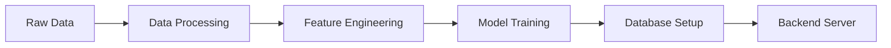

# Interactive Tutorial

Walk through Movie Genie step-by-step to understand how everything works together.

## Tutorial Overview

This tutorial will guide you through:

1. **Setting up the complete system**
2. **Understanding the data pipeline**
3. **Exploring ML models in action**
4. **Using the web application**
5. **Testing different recommendation approaches**

Expected time: **30 minutes**

## Step 1: Initial Setup (5 minutes)

### Verify Prerequisites
```bash
# Check your system
python --version    # Should be 3.8+
node --version      # Should be 16+
git --version       # Any recent version
```

### Install Movie Genie
```bash
# Clone and setup
git clone <repository-url>
cd movie-genie

# Create virtual environment
python -m venv .venv
source .venv/bin/activate  # Windows: .venv\Scripts\activate

# Install the project
pip install -e .
```

!!! success "Checkpoint 1"
    Verify installation: `pip list | grep movie-genie` should show the package.

## Step 2: Run the Data Pipeline (10 minutes)

### Understanding DVC Pipeline
The DVC pipeline processes data and trains models in stages:



### Run the Complete Pipeline
```bash
# This will take about 10 minutes
dvc repro

# Watch the progress - you'll see each stage:
# 1. data_processing - Clean MovieLens data
# 2. feature_engineering - Create ML features
# 3. train_bert4rec - Train sequential model (~5 min)
# 4. train_two_tower - Train collaborative model (~3 min)
# 5. setup_semantic_search - Setup search engine
# 6. setup_database - Create SQLite database
# 7. backend_server - Start Flask application
```

### What's Happening Behind the Scenes

While the pipeline runs, here's what each stage does:

**Data Processing**:
```bash
# Check what data was processed
ls -la data/processed/
# You'll see: movies.parquet, ratings.parquet, users.parquet
```

**Model Training**:
```bash
# Models are saved here
ls -la models/
# You'll see: bert4rec/, two_tower/, semantic_search/
```

**Database Creation**:
```bash
# Database is created
ls -la movie_genie/backend/movie_genie.db
```

!!! success "Checkpoint 2"
    Pipeline complete when you see the Flask server running on `http://127.0.0.1:5001`

## Step 3: Explore the Web Application (10 minutes)

### Access the Application
1. **Open your browser** to: `http://127.0.0.1:5001`
2. **Select a user ID** (try 123) and click "Start Exploring"

### Test Different Features

#### Popular Movies Section
- **What you see**: Grid of popular movies from the dataset
- **What's happening**: API call to `/api/movies/popular`
- **ML involvement**: Movies ranked by popularity and user preferences

#### Search Functionality
- **Try this search**: "action movies with robots"
- **What you see**: Relevant movies appear in a grid
- **What's happening**: Semantic search using sentence embeddings
- **ML model**: Sentence-BERT for content-based search

#### Personalized Recommendations
- **What you see**: Movies recommended specifically for user 123
- **What's happening**: BERT4Rec model analyzes user's viewing history
- **ML model**: Transformer-based sequential recommendation

### Behind the Scenes API Calls

Open browser developer tools (F12) and watch the Network tab:

```bash
# You'll see these API calls:
GET /api/users/info               # Get user information
GET /api/movies/popular           # Fetch popular movies
GET /api/search/semantic?q=...    # Semantic search
GET /api/recommendations/personalized?user_id=123  # Personalized recs
```

!!! success "Checkpoint 3"
    You can successfully search for movies and see personalized recommendations.

## Step 4: Test Different Users (5 minutes)

### Compare User Preferences

Try different user IDs to see how recommendations change:

#### User 123 (Action/Sci-Fi Fan)
```bash
# In the app, select user ID 123
# Notice the recommended movies - likely action/sci-fi heavy
```

#### User 456 (Romance/Comedy Fan)
```bash
# Change to user ID 456
# See how recommendations shift to romance/comedy
```

#### User 789 (Horror/Thriller Fan)
```bash
# Change to user ID 789
# Notice the darker, thriller-focused recommendations
```

### API Testing

Test the APIs directly while the app is running:

```bash
# Test different users
curl "http://127.0.0.1:5001/api/recommendations/personalized?user_id=123&limit=5"
curl "http://127.0.0.1:5001/api/recommendations/personalized?user_id=456&limit=5"

# Test semantic search
curl "http://127.0.0.1:5001/api/search/semantic?q=funny%20movies&limit=5"
curl "http://127.0.0.1:5001/api/search/semantic?q=scary%20movies&limit=5"
```

!!! success "Checkpoint 4"
    You understand how different users get different recommendations.

## Step 5: Understand the ML Models (Optional - 5 minutes)

### Test Model Performance

#### BERT4Rec (Sequential Recommendations)
```python
# Test the BERT4Rec model directly
python -c "
from movie_genie.ranking.bert4rec_model import BERT4RecReranker
reranker = BERT4RecReranker('models/bert4rec/')
recommendations = reranker.predict(user_id=123, num_recommendations=5)
print('BERT4Rec recommendations:', recommendations)
"
```

#### Two-Tower (Collaborative Filtering)
```python
# Test the Two-Tower model
python -c "
from movie_genie.retrieval.two_tower_model import TwoTowerReranker
reranker = TwoTowerReranker('models/two_tower/')
recommendations = reranker.predict(user_id=123, num_recommendations=5)
print('Two-Tower recommendations:', recommendations)
"
```

#### Semantic Search
```python
# Test semantic search
python -c "
from movie_genie.search.semantic_engine import SemanticSearchEngine
engine = SemanticSearchEngine('configs/semantic_search.yaml')
results = engine.search('action movies with robots', k=5)
print('Semantic search results:', results)
"
```

## Tutorial Complete! 🎉

### What You've Accomplished

1. ✅ **Set up a complete ML system** with data pipeline and trained models
2. ✅ **Understood the DVC workflow** for reproducible ML
3. ✅ **Explored three different recommendation approaches**
4. ✅ **Tested the full-stack web application**
5. ✅ **Compared different user preferences**

### What You've Learned

- **Data Pipeline**: How DVC manages reproducible ML workflows
- **ML Models**: Three different approaches to recommendations
- **Full-Stack Integration**: How ML models serve web applications
- **API Design**: RESTful patterns for ML services
- **User Personalization**: How different users get different experiences

## Next Steps

Now that you understand the basics:

1. **Modify the models**: Edit `params.yaml` and retrain with `dvc repro`
2. **Add new features**: Extend the API or frontend
3. **Experiment with data**: Try different preprocessing approaches
4. **Deploy to production**: Learn about scaling and monitoring

### Recommended Reading

- **[Models Overview](../machine-learning/models-overview.md)**: Deep dive into ML architectures
- **[API Reference](../backend-frontend/api-reference.md)**: Complete endpoint documentation
- **[ML Integration Guide](../backend-frontend/ml-integration.md)**: Connect new models to the frontend

### Troubleshooting

If you encountered any issues during this tutorial:

- **Check [Troubleshooting Guide](../troubleshooting/)** for common solutions
- **Verify system requirements** in [Installation Guide](installation.md)
- **Review [Commands Reference](commands-reference.md)** for correct syntax

Congratulations! You now have hands-on experience with a complete ML recommendation system. 🎬