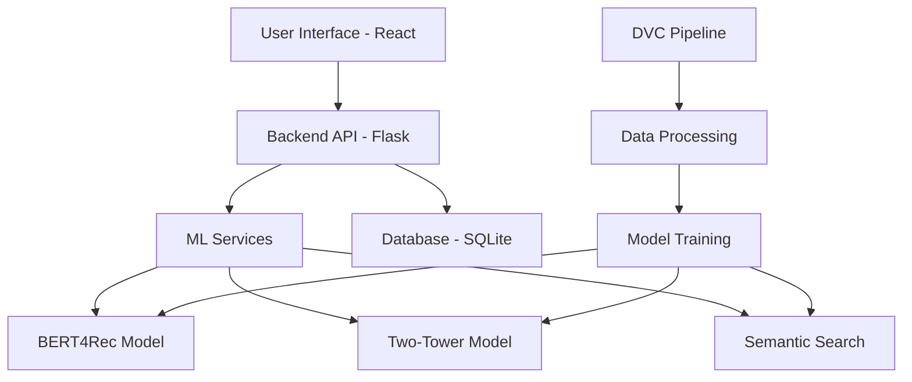

# 🎬 Movie Genie Documentation

Welcome to the comprehensive documentation for **Movie Genie** - an AI-powered movie recommendation system that demonstrates modern ML engineering and full-stack development best practices.

{ align=left width=300 }

**Movie Genie** is a complete movie recommendation system that showcases:

- **🧠 Advanced ML Models**: BERT4Rec, Two-Tower, and Semantic Search
- **🌐 Full-Stack Integration**: React frontend + Flask backend
- **🔄 MLOps Pipeline**: DVC-managed data and model workflows
- **📊 Production Ready**: Docker deployment and monitoring

This project serves as both a **functional recommendation system** and a **comprehensive learning reference** for building modern ML applications.

---

## 🚀 Quick Navigation

<div class="grid cards" markdown>

-   :material-rocket-launch:{ .lg .middle } **Getting Started**

    ---

    New to Movie Genie? Start here for setup and overview.

    [:octicons-arrow-right-24: Quick Start](getting-started/quick-start.md)

-   :material-brain:{ .lg .middle } **Machine Learning**

    ---

    Deep dive into recommendation models and ML architecture.

    [:octicons-arrow-right-24: ML Models](machine-learning/)

-   :material-pipe:{ .lg .middle } **Data Pipeline**

    ---

    Learn about data processing and DVC workflows.

    [:octicons-arrow-right-24: Data Pipeline](data-pipeline/)

-   :material-web:{ .lg .middle } **Backend & Frontend**

    ---

    Full-stack development and ML integration patterns.

    [:octicons-arrow-right-24: Architecture](backend-frontend/)

-   :material-rocket:{ .lg .middle } **Deployment**

    ---

    Deploy Movie Genie to development and production.

    [:octicons-arrow-right-24: Deploy](deployment/)

-   :material-help-circle:{ .lg .middle } **Troubleshooting**

    ---

    Solve common issues and debug problems.

    [:octicons-arrow-right-24: Help](troubleshooting/)

</div>

---

## 🎯 What You'll Learn

After working through this documentation, you'll understand:

### Machine Learning Engineering
- [x] **Model Architecture**: Transformer-based recommendations
- [x] **Training Pipelines**: Reproducible ML workflows
- [x] **Model Evaluation**: Performance metrics and comparison
- [x] **Production ML**: Serving models in web applications

### Full-Stack Development
- [x] **API Design**: RESTful services for ML applications
- [x] **Frontend Integration**: Connect ML outputs to UI
- [x] **State Management**: Handle complex application state
- [x] **Performance**: Optimize for real-time experience

### MLOps & DevOps
- [x] **Data Versioning**: Track datasets and model artifacts
- [x] **Pipeline Automation**: Reproducible workflows
- [x] **Environment Management**: Consistent deployments
- [x] **Monitoring**: System health and model performance

---

## 🏗️ System Architecture



---

## 📊 Key Technologies

| Category | Technology | Purpose |
|----------|------------|---------|
| **Frontend** | React + TypeScript | Modern, responsive UI |
| **Backend** | Flask + Python | RESTful API server |
| **ML Models** | PyTorch + Transformers | BERT4Rec, Two-Tower models |
| **Search** | Sentence Transformers | Semantic movie search |
| **Data Pipeline** | DVC + Pandas | Data versioning & processing |
| **Database** | SQLite | Movie and user data storage |
| **Deployment** | Docker + Gunicorn | Production deployment |

---

## ⚡ Quick Start

Get Movie Genie running in 5 minutes:

```bash
# 1. Clone and install
git clone <repository-url>
cd movie-genie
pip install -e .

# 2. Run the complete pipeline
dvc repro

# 3. Access the application
# Open browser to: http://127.0.0.1:5001
```

!!! success "That's it!"
    Choose a user ID (1-610) and start exploring AI-powered movie recommendations.

---

## 📚 Documentation Structure

The documentation is organized into logical sections for progressive learning:

### [:material-rocket-launch: Getting Started](getting-started/)
Essential guides to get you up and running quickly.

### [:material-brain: Machine Learning](machine-learning/)
Comprehensive coverage of all ML models and techniques.

### [:material-pipe: Data Pipeline](data-pipeline/)
Data processing, feature engineering, and DVC workflows.

### [:material-web: Backend & Frontend](backend-frontend/)
Full-stack architecture and integration patterns.

### [:material-cog: Configuration](configuration/)
Environment setup and configuration management.

### [:material-bug: Troubleshooting](troubleshooting/)
Common issues, debugging, and problem solving.

### [:material-book: Reference](reference/)
Technical reference, APIs, and implementation details.

---

## 🤝 Contributing

This is a learning project, but contributions are welcome:

1. **Documentation**: Improve clarity or add missing information
2. **Examples**: Add more use cases or integration examples
3. **Models**: Implement additional recommendation algorithms
4. **Features**: Enhance the UI or add new functionality

---

## 🔗 External Links

- [:fontawesome-brands-github: GitHub Repository](https://github.com/your-username/movie-genie)
- [:fontawesome-brands-python: Python Package](https://pypi.org/project/movie-genie/)
- [:material-file-document: Paper](https://arxiv.org/abs/your-paper)

---

!!! tip "Learning Path"
    New to recommendation systems? Start with [Project Overview](getting-started/project-overview.md) to understand the big picture, then follow the [Quick Start](getting-started/quick-start.md) guide.

!!! info "Need Help?"
    Check the [Troubleshooting](troubleshooting/) section for common issues, or open an issue on GitHub for project-specific questions.

*Movie Genie demonstrates modern ML engineering practices in a complete, working application. Perfect for learning recommendation systems, full-stack development, and MLOps workflows.* 🎬