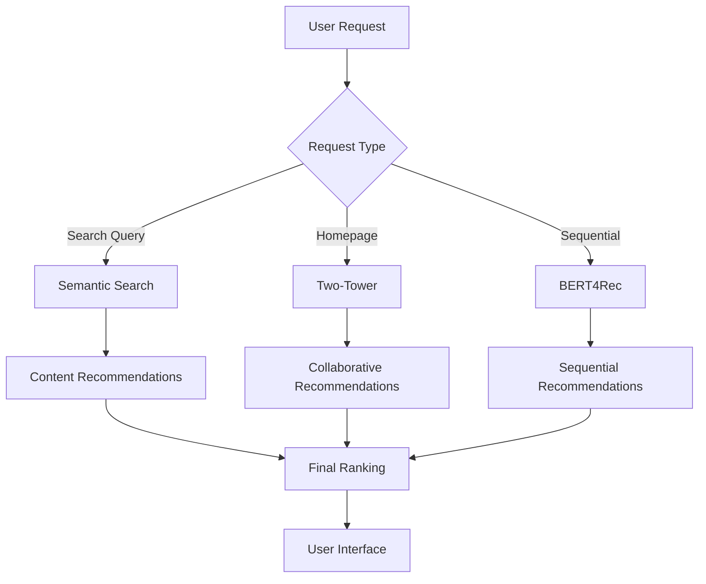

# 🧠 Machine Learning Models

!!! abstract "Section Overview"
    This section covers all machine learning models used in Movie Genie, from theoretical foundations to practical implementation.

Movie Genie implements three state-of-the-art recommendation and search models, each optimized for different use cases and data scenarios.

## 🎯 Model Overview

| Model | Type | Best For | Input Data | Output |
|-------|------|----------|------------|--------|
| **BERT4Rec** | Sequential | Users with interaction history | User sequence + item features | Next-item predictions |
| **Two-Tower** | Collaborative | Large-scale recommendations | User-item interactions | User/item embeddings |
| **Semantic Search** | Content-Based | Text-based discovery | Movie descriptions + queries | Similarity rankings |

---

## 📚 Detailed Documentation

### [🧠 BERT4Rec Model](bert4rec.md)
**Sequential Recommendation Model**
- Transformer-based architecture for next-item prediction
- Handles user interaction sequences and item features
- Perfect for "users who liked X will like Y" scenarios
- Supports cold-start users with content features

### [🏗️ Two-Tower Model](two-tower.md)
**Collaborative Filtering Model**
- Dual-encoder architecture for user and item embeddings
- Scalable to millions of users and items
- Excellent for finding similar users and items
- Fast inference with pre-computed embeddings

### [🔍 Semantic Search](semantic-search.md)
**Content-Based Search Model**
- Embedding-based similarity search
- Natural language query understanding
- Handles complex, descriptive search queries
- Zero-shot learning on new movie content

### [📈 Model Evaluation](evaluation.md)
**Performance Analysis & Comparison**
- Comprehensive evaluation metrics
- A/B testing framework
- Model comparison guidelines
- Performance optimization strategies

---

## 🎯 When to Use Which Model

### **BERT4Rec** 🧠
**Use When:**
- ✅ User has significant interaction history (5+ movies)
- ✅ You want sequential/temporal recommendations
- ✅ User preferences change over time
- ✅ You have rich item content features

**Example Use Cases:**
- "More like your recent watches"
- "Continue watching" recommendations
- Trending predictions based on viewing patterns

### **Two-Tower** 🏗️
**Use When:**
- ✅ You have large-scale user-item interaction data
- ✅ You need fast, real-time recommendations
- ✅ You want to find similar users or items
- ✅ Cold-start scenarios with minimal history

**Example Use Cases:**
- Homepage personalized recommendations
- "Users like you also watched"
- Large-scale batch recommendations

### **Semantic Search** 🔍
**Use When:**
- ✅ Users search with natural language queries
- ✅ You want content-based discovery
- ✅ Handling zero-shot scenarios
- ✅ Complex, descriptive search needs

**Example Use Cases:**
- "Sci-fi movies with time travel"
- "Funny movies for family night"
- Genre and mood-based discovery

---

## 🔧 Model Architecture Comparison

### **BERT4Rec Architecture**
```
User Sequence → BERT Encoder → Item Features → Attention → Next Item Probabilities
[movie1, movie2, ...] → Transformer → Content Features → Output Layer → Recommendations
```

### **Two-Tower Architecture**
```
User Features → User Encoder → User Embedding
                                    ↓
                                Cosine Similarity → Ranking
                                    ↑
Item Features → Item Encoder → Item Embedding
```

### **Semantic Search Architecture**
```
Text Query → SentenceTransformer → Query Embedding
                                        ↓
                                   Similarity Search
                                        ↑
Movie Descriptions → SentenceTransformer → Movie Embeddings
```

---

## 📊 Performance Characteristics

| Metric | BERT4Rec | Two-Tower | Semantic Search |
|--------|----------|-----------|-----------------|
| **Training Time** | High (hours) | Medium (minutes) | Low (pre-trained) |
| **Inference Speed** | Medium | Fast | Fast |
| **Memory Usage** | High | Medium | Low |
| **Cold-Start** | Good | Excellent | Excellent |
| **Personalization** | Excellent | Good | None |
| **Scalability** | Medium | High | High |

---

## 🛠️ Implementation Strategy

### **Development Phase**
1. **Start with Two-Tower**: Fastest to implement and validate
2. **Add Semantic Search**: Enhance discovery capabilities
3. **Implement BERT4Rec**: Advanced sequential modeling

### **Production Phase**
1. **A/B Test**: Compare models on real user behavior
2. **Ensemble**: Combine models for different use cases
3. **Optimize**: Fine-tune based on performance metrics

---

## 🔄 Model Integration Flow



---

## 📈 Evaluation Metrics

### **Offline Metrics**
- **NDCG@K**: Ranking quality
- **Recall@K**: Coverage of relevant items
- **MAP**: Mean Average Precision
- **AUC**: Area Under ROC Curve

### **Online Metrics**
- **Click-Through Rate (CTR)**: User engagement
- **Conversion Rate**: Action completion
- **Session Length**: User retention
- **Diversity**: Recommendation variety

---

## 🚀 Getting Started

1. **Understand the Theory**: Read individual model documentation
2. **See Models in Action**: Run the full application
3. **Experiment**: Modify model parameters and observe results
4. **Evaluate**: Use the evaluation framework to compare performance
5. **Optimize**: Tune models for your specific use case

---

*Each model serves a specific purpose in the recommendation ecosystem. Understanding their strengths and limitations will help you build more effective recommendation systems.*