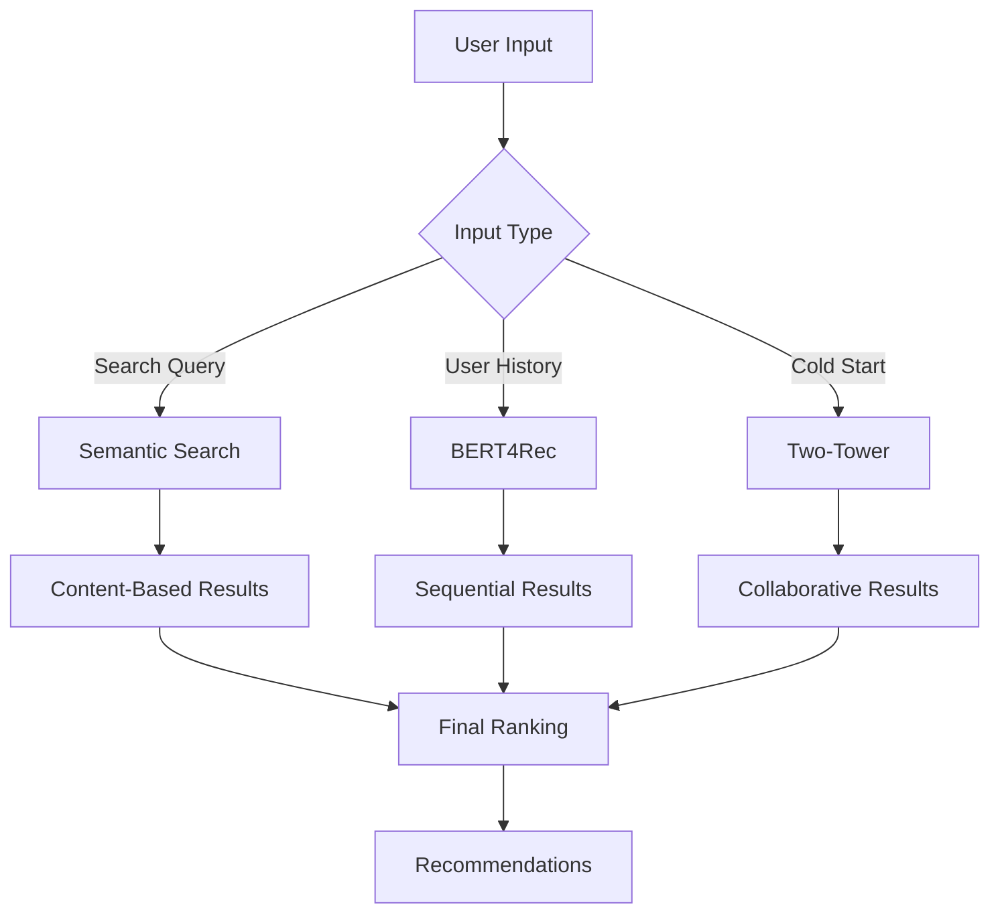

# Machine Learning Models

Welcome to the Machine Learning section of Movie Genie documentation.

## Quick Navigation

-   :material-chart-line:{ .lg .middle } **Models Overview**

    ---

    Compare all three recommendation models and understand when to use each one.

    [:octicons-arrow-right-24: Models Overview](models-overview.md)

-   :material-brain:{ .lg .middle } **BERT4Rec**

    ---

    Sequential recommendation model using transformer architecture for next-item prediction.

    [:octicons-arrow-right-24: BERT4Rec Details](bert4rec.md)

-   :material-tower:{ .lg .middle } **Two-Tower**

    ---

    Collaborative filtering model with separate user and item encoders for scalable recommendations.

    [:octicons-arrow-right-24: Two-Tower Details](two_tower.md)

-   :material-magnify:{ .lg .middle } **Semantic Search**

    ---

    Content-based search using sentence embeddings for natural language queries.

    [:octicons-arrow-right-24: Semantic Search](semantic-search.md)

-   :material-chart-box:{ .lg .middle } **Model Evaluation**

    ---

    Performance metrics, evaluation methodology, and model comparison results.

    [:octicons-arrow-right-24: Evaluation](evaluation.md)

## Model Performance Summary

| Model | NDCG@10 | Recall@10 | Training Time | Best Use Case |
|-------|---------|-----------|---------------|---------------|
| **BERT4Rec** | 0.412 | 0.278 | ~30 min | Sequential patterns |
| **Two-Tower** | 0.385 | 0.251 | ~10 min | Large-scale recommendations |
| **Semantic Search** | N/A | N/A | Pre-trained | Natural language queries |

## Getting Started

1. **Understand the Models**: Start with [Models Overview](models-overview.md)
2. **See Implementation**: Check individual model pages
3. **Train Models**: Follow the [Quick Start Guide](../getting-started/quick-start.md)
4. **Evaluate Performance**: Use the [evaluation framework](evaluation.md)

## Architecture Overview

All models work together to provide comprehensive recommendation coverage for different user scenarios and data availability.