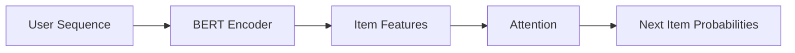
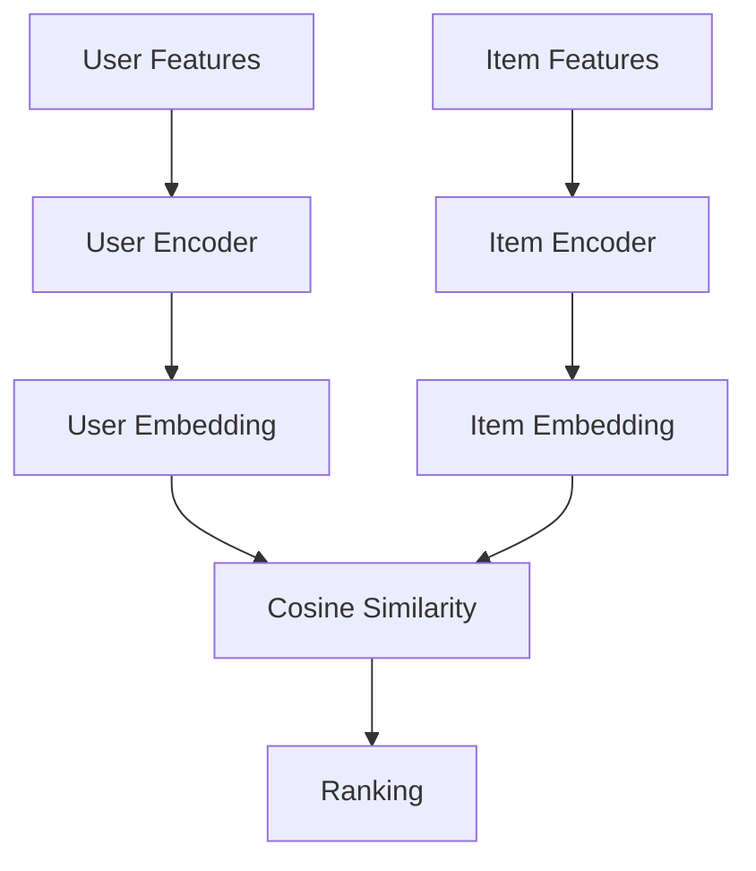
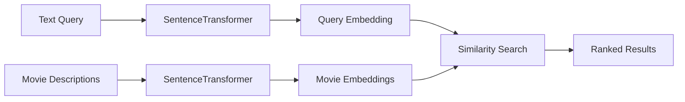
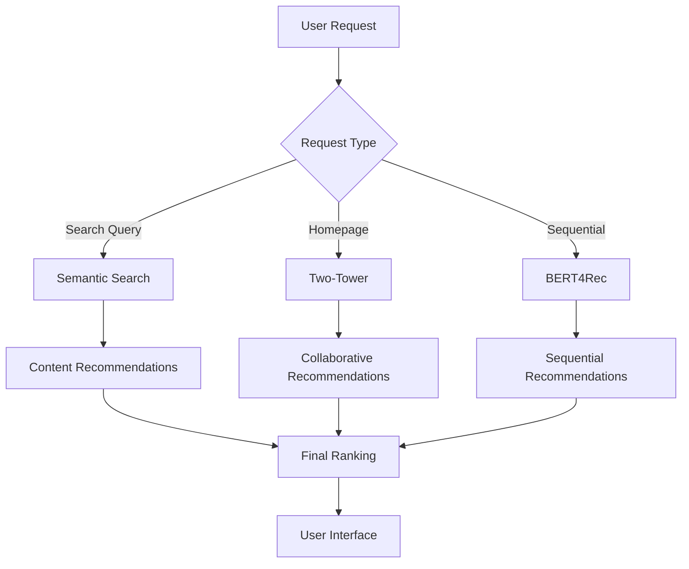

# 📊 ML Models Overview

This page provides a comprehensive comparison of all machine learning models used in Movie Genie.

---

## 🎯 Model Comparison

| Model | Type | Best For | Input Data | Output |
|-------|------|----------|------------|--------|
| **BERT4Rec** | Sequential | Users with interaction history | User sequence + item features | Next-item predictions |
| **Two-Tower** | Collaborative | Large-scale recommendations | User-item interactions | User/item embeddings |
| **Semantic Search** | Content-Based | Text-based discovery | Movie descriptions + queries | Similarity rankings |

---

## 📈 Performance Characteristics

| Metric | BERT4Rec | Two-Tower | Semantic Search |
|--------|----------|-----------|-----------------|
| **Training Time** | High (hours) | Medium (minutes) | Low (pre-trained) |
| **Inference Speed** | Medium | Fast | Fast |
| **Memory Usage** | High | Medium | Low |
| **Cold-Start** | Good | Excellent | Excellent |
| **Personalization** | Excellent | Good | None |
| **Scalability** | Medium | High | High |

---

## 🎯 When to Use Which Model

### **BERT4Rec** 🧠

!!! success "Use When"
    - ✅ User has significant interaction history (5+ movies)
    - ✅ You want sequential/temporal recommendations
    - ✅ User preferences change over time
    - ✅ You have rich item content features

!!! example "Example Use Cases"
    - "More like your recent watches"
    - "Continue watching" recommendations
    - Trending predictions based on viewing patterns

### **Two-Tower** 🏗️

!!! success "Use When"
    - ✅ You have large-scale user-item interaction data
    - ✅ You need fast, real-time recommendations
    - ✅ You want to find similar users or items
    - ✅ Cold-start scenarios with minimal history

!!! example "Example Use Cases"
    - Homepage personalized recommendations
    - "Users like you also watched"
    - Large-scale batch recommendations

### **Semantic Search** 🔍

!!! success "Use When"
    - ✅ Users search with natural language queries
    - ✅ You want content-based discovery
    - ✅ Handling zero-shot scenarios
    - ✅ Complex, descriptive search needs

!!! example "Example Use Cases"
    - "Sci-fi movies with time travel"
    - "Funny movies for family night"
    - Genre and mood-based discovery

---

## 🔧 Model Architecture Comparison

### **BERT4Rec Architecture**

### **Two-Tower Architecture**

### **Semantic Search Architecture**

---

## 📊 Evaluation Metrics

### Offline Metrics
- **NDCG@K**: Ranking quality
- **Recall@K**: Coverage of relevant items
- **MAP**: Mean Average Precision
- **AUC**: Area Under ROC Curve

### Online Metrics
- **Click-Through Rate (CTR)**: User engagement
- **Conversion Rate**: Action completion
- **Session Length**: User retention
- **Diversity**: Recommendation variety

---

## 🛠️ Implementation Strategy

### Development Phase
1. **Start with Two-Tower**: Fastest to implement and validate
2. **Add Semantic Search**: Enhance discovery capabilities
3. **Implement BERT4Rec**: Advanced sequential modeling

### Production Phase
1. **A/B Test**: Compare models on real user behavior
2. **Ensemble**: Combine models for different use cases
3. **Optimize**: Fine-tune based on performance metrics

---

## 🔄 Model Integration Flow

---

## 📚 Detailed Model Documentation

For comprehensive details on each model:

- **[BERT4Rec Model](bert4rec.md)** - Sequential recommendation implementation
- **[Two-Tower Model](two-tower.md)** - Collaborative filtering architecture
- **[Semantic Search](semantic-search.md)** - Content-based search engine
- **[Model Evaluation](evaluation.md)** - Performance analysis and comparison

---

*Each model serves a specific purpose in the recommendation ecosystem. Understanding their strengths and limitations helps you build more effective recommendation systems.*